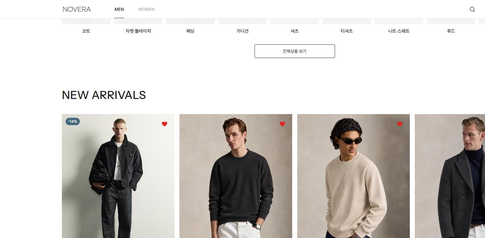
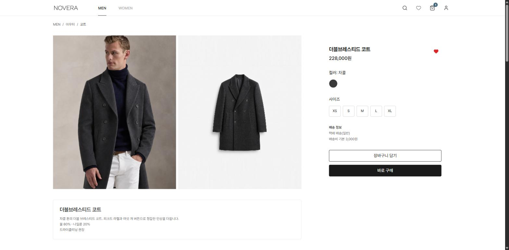

# NOVERA — 반응형 의류 쇼핑몰

React(TypeScript) + Supabase 기반으로 제작한 반응형 의류 쇼핑몰입니다. 포트폴리오 및 학습 목적으로 만들었으며, 상품 탐색부터 장바구니·주문·리뷰·반품, 관리자 콘텐츠 관리까지 실제 서비스에 가까운 플로우를 직접 구현했습니다.

**배포**: https://shopping-386krhzde-jun-3797.vercel.app

## 스크린샷

| 홈 | 상품 목록 | 상품 상세 |
|---|---|---|
|  |  |  |

## 프로젝트 소개

처음엔 React(JS) + 커스텀 CSS로 시작했다가, 타입 안정성과 유지보수성을 위해 TypeScript + Tailwind CSS로 전면 마이그레이션했습니다. 백엔드 서버 없이 Supabase(Postgres + Auth + Storage)를 직접 프론트엔드에서 호출하는 구조라, 데이터 접근 제어를 전부 DB 레벨(RLS)에서 설계한 것이 특징입니다.

## 주요 기능

**사용자**
- 상품 탐색 (카테고리/서브카테고리 필터, 신상품/베스트 정렬)
- 상품 상세, 리뷰 작성/조회 (구매 후에만 작성 가능)
- 장바구니, 위시리스트 (비로그인도 찜 가능 → 로그인 시 자동 병합)
- 주문/결제(가상), 주문 취소, 반품 신청(사진 첨부)
- 마이페이지 (주문 내역, 반품 현황)

**관리자**
- 상품 관리 (등록/수정/삭제, 드래그 정렬)
- 주문 관리 (배송 상태 변경, 반품 접수/완료 처리)
- 회원 관리, 매출 관리
- 콘텐츠 관리 (히어로 배너, 에디토리얼 배너, 카테고리 구성 편집)

## 기술 스택

| 구분 | 기술 |
|---|---|
| Frontend | React 19, TypeScript, Tailwind CSS 4, Vite, React Router |
| Backend / Infra | Supabase (Auth, Postgres, Storage, Row Level Security), Vercel |
| 기타 라이브러리 | react-easy-crop, embla-carousel, recharts |

## 기술적으로 신경 쓴 부분

### 1. Row Level Security(RLS)로 데이터 접근 제어

이 프로젝트는 별도 백엔드 서버 없이 프론트엔드가 Supabase(Postgres)에 직접 쿼리를 보내는 구조입니다. 그래서 "누가 어떤 행을 보고/고칠 수 있는지"를 서버 코드가 아니라 DB 자체가 검증합니다.

- 장바구니/위시리스트: 본인 소유 행만 select/insert/update/delete 가능 (`auth.uid() = user_id`)
- 상품/콘텐츠: 조회는 전체 공개, 쓰기는 관리자만 (`is_admin()` 함수로 재사용 가능한 정책 구성)
- 주문: RLS만으로는 컬럼 단위 전이 규칙(예: "배송완료 상태에서만 반품 요청 가능")을 표현할 수 없어, `BEFORE UPDATE` 트리거로 한 번 더 검증하는 이중 방어 구조를 적용했습니다.

### 2. 장바구니 / 위시리스트 하이브리드 저장 구조

장바구니는 로그인 사용자 전용 DB 테이블로, 위시리스트는 "비로그인도 찜할 수 있어야 한다"는 요구사항 때문에 게스트는 localStorage, 로그인 사용자는 DB를 쓰는 하이브리드 구조로 설계했습니다. 로그인 시 게스트 localStorage 데이터를 자동으로 계정 DB에 병합합니다.

### 3. 반응형 이미지 크롭

관리자가 히어로/배너 이미지를 업로드할 때 모바일(3:4)·태블릿(1:1)·데스크톱(16:9) 브레이크포인트별로 각각 다른 비율로 크롭해서 저장할 수 있도록 구현했습니다.

## 실행 방법

```bash
git clone <repo-url>
cd shopping
npm install
```

루트에 `.env.local` 파일을 생성합니다:

```
VITE_SUPABASE_URL=
VITE_SUPABASE_ANON_KEY=
```

```bash
npm run dev
```

## 범위 제외

- 실제 PG 결제 연동은 없습니다 (가상 결제로 처리)
- 소셜 로그인은 지원하지 않습니다 (이메일/비밀번호 로그인만 제공)
